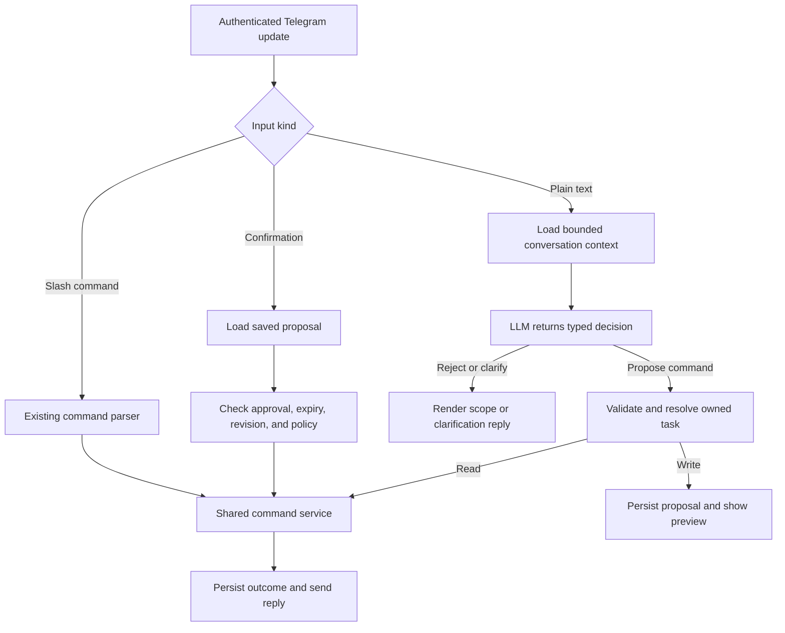

# Natural-language commands

Status: proposed design, 2026-09-30. This feature is not implemented.

## Decisions

Add a bounded LLM interpreter for the existing task commands. The model
proposes a typed operation; application code validates, authorizes, previews,
and executes it. Start with one operation per request.

| Question | Recommendation |
| --- | --- |
| Microsoft Agent Framework? | Defer. The flow has fixed steps and already uses Durable Functions. |
| Microsoft.Extensions.AI? | Optional infrastructure dependency. Keep the first version on the existing OpenRouter transport unless an adapter demonstrably reduces code. |
| Commands as skills? | Describe commands with typed schemas, concise semantics, and examples. Separate skill files are unnecessary. |
| Chat memory? | Yes: short-lived draft and task-reference state, plus a small recent-message window. |
| LLM compaction? | Defer. Bound the window and retain structured state deterministically. |
| Human approval? | Execute reads directly; confirm every natural-language create, update, and delete initially. Approval of a schedule covers its subsequent runs. |

## Existing foundations and gaps

- `UpdateDispatcher` routes `/create`, `/get`, `/update`, `/list`, and
  `/delete`; other text currently receives help.
- `TaskDefinitionParser`, `TaskUpdater`, `TaskCommitValidator`, and
  `TaskScheduleResolver` already define valid settings and schedule behavior.
- Handlers use owner-scoped task lookups. Updates guard revisions and lifecycle
  state and atomically record applied commands. Preserve those protections.
- Handlers currently combine text parsing, execution, receipts, and replies.
  Extract shared typed execution services so both input paths use the same rules.
- `ILlmExecutor` and `LlmRequest` serve scheduled answer generation. They do
  not currently express structured command results. Add a separate contract.
- Existing `PreviousSuccessfulReply` memory belongs to scheduled execution.
  It must not serve as the command conversation history.
- `TelegramUpdateParser` currently ignores callbacks and does not check
  `chat.type`, despite its private-chat comment. It also defaults missing
  identity fields to zero. Validate the supported chat type and identity
  before any conversation lookup or model call.
- README's positional cron quick reference is stale; the implemented contract
  is [TelegramCommands](TelegramCommands.md). Use that contract for this feature.

## User experience and scope

Examples below assume the user has explicitly chosen `Europe/Moscow`.

| Input | Behavior |
| --- | --- |
| “Show my tasks” | Execute list and use the existing renderer. |
| “Show the settings for my AI news task” | Resolve an owned task; ask the user to choose if several match. |
| “Summarize AI news every weekday at 9 AM” | Preview a create with cron `0 0 9 * * 1-5`, timezone, prompt, effective parameters, and next runs. |
| “Make it 10 instead” | Revise the active draft or propose an update to an unambiguous recent task. |
| “Delete my AI news task” | Show the resolved task and request confirmation. |
| “Summarize AI news” | Ask whether and when to schedule it; do not run an immediate research request. |
| “Explain quantum physics” | Reject as outside task management and show a short scheduling example. |
| “Explain quantum physics every Monday at noon” | Accept as task creation: the subject of a scheduled prompt can be arbitrary. |
| “How do I change a task's schedule?” | Return command help. |
| “Pause all my tasks” | Explain that pause and bulk operations are unsupported; do not translate this into deletion. |

Supported operations are exactly the five existing commands, plus conversation
actions for help, clarification, confirmation, and cancellation. No shell,
arbitrary HTTP, database query, immediate research, or model-selected recipients.
Multi-operation requests ask the user to choose one action; never execute a
partial subset silently. Mixed unrelated requests receive a scope response.

Creation preserves the requested task content and explicit parameters. Do not
add sources, a different topic, expiration, or a run limit without user intent.
Scheduling a literal reminder needs a preview that accurately reflects today's
LLM-generated delivery behavior; this feature does not introduce exact-message
delivery guarantees.

For a mutation, render a preview from validated data:

> Create a task: Summarize AI news
>
> Every weekday at 09:00, Europe/Moscow
>
> Next runs: [three dates computed by the schedule resolver]
>
> Web search: on. Previous-answer memory: [effective setting].
>
> Reasoning: [effective setting]. Ends: no limit.
>
> [Confirm] [Cancel]

Updates show the current and proposed values for changed fields, including
whether a completed task will resume. Deletes identify the exact task and
explain that future runs will stop; never promise to recall messages already
sent. Long prompt previews must expose the complete proposed prompt before
approval, using the existing message splitting or document transport.

## Processing flow

1. Authenticate the webhook and validate a private message with a real sender
   and chat ID. Handle exact slash commands and confirmation controls without
   an LLM. Unknown slash commands retain existing usage behavior.
2. Deduplicate by trusted owner and Telegram update ID before paid work. For
   plain text, durably accept a short command workflow under a stable instance
   ID before returning HTTP 200. Use the existing Durable infrastructure;
   external I/O runs in activities. Return 503 if durable acceptance fails.
3. Load conversation state under `(ownerId, chatId)`. Build bounded context
   from the current request, draft, selected task, and recent visible choices.
   Load only owned candidates; paginate and ask for an ID if there are too many.
4. Make one structured-output call to interpret scope and arguments together.
   A separate classifier is unnecessary initially and is not an authorization
   boundary. If a newly selected task requires full settings, permit one
   additional bounded interpretation call after an owner-scoped lookup.
5. Validate the result, resolve references, and apply existing domain validators.
   Missing material information becomes a clarification. Never choose between
   ambiguous tasks or silently repair unsupported settings.
6. Reads execute immediately. Writes become persisted proposals. Preview
   rendering, clarification templates, and success messages come from code.
7. Confirmation executes the saved proposal without another model call.
   Report success only from committed application results. Retain results
   separately from reply delivery so a send failure cannot repeat a mutation.

The workflow uses a short interpretation budget, not the scheduled-generation
timeout or search budget. Persist the accepted interpretation before proceeding;
an activity retry after that point reloads it. A crash before persistence can
repeat inference, but no command has executed yet.

## Model contract and command catalog

Add `ICommandInterpreter.InterpretAsync(CommandInterpretationRequest)` in
Application. Infrastructure owns `OpenRouterCommandInterpreter`. Keep provider
types outside Application, preserving the existing project boundary.

The result is a discriminated union with strict per-variant fields:

- `ProposeCommand`: one of `ListTasks`, `GetTask`, `CreateTask`, `UpdateTask`,
  or `DeleteTask`, and that command's typed arguments.
- `Clarify`: an allowed reason such as missing schedule, missing timezone,
  ambiguous task, or unsupported recurrence, with bounded slot information.
- `Reject`: a bounded reason code such as unrelated request or unsupported action.
- `Help`: an allowlisted command topic.

There is no arbitrary answer field, generated command string, executable code,
approval flag, owner ID, chat ID, storage key, or orchestration ID in the model
contract. Server code attaches identity, proposal IDs, revisions, and policy.
Task references returned by the model must resolve against owned records.

Maintain one versioned catalog containing operation names, JSON schemas,
required fields, valid enums, examples, and important semantics: timezone
immutability, schedule replacement, limits, and update omission versus null.
Reuse the existing task types and validators; add contract tests to detect
drift between catalog schemas and command behavior.

Strict structured output is the recommended first transport. Function calling
is also viable if calls only produce proposals and pass through the same
validator; do not enable automatic invocation of mutating handlers.
OpenRouter supports JSON Schema output on compatible endpoints. Configure
`response_format` with `json_schema`, strict mode, and
`provider.require_parameters: true`; verify the chosen endpoint in a bounded
smoke test. Provider enforcement varies, so always validate locally.
See [OpenRouter structured outputs](https://openrouter.ai/docs/guides/features/structured-outputs).

## Guardrails

### Scope and prompt injection

The interpreter instruction states its supported operations and returns a
scope decision for unrelated requests. Stored prompts, quoted text, previous
bot answers, and task descriptions are untrusted data. They cannot override
the command policy. Never feed scheduled answers or web-search results into
command interpretation; the interpreter has no search or execution tools.

The semantic distinction is the user's requested action, not topic keywords.
“Write a poem” is outside scope; “send me a new poem every Friday” is in scope.
Instructions inside that poem prompt cannot delete tasks or change settings.
Reply-based prompt input keeps the existing same-author rule.

No prompt or classifier can guarantee perfect relevance detection. Security
rests on narrow capabilities, deterministic checks, and approval of writes.
A false-positive scope decision still cannot execute an arbitrary action.

### Deterministic enforcement

- Reject unknown operations, unknown or duplicate properties, invalid enums,
  oversized payloads, multiple commands, malformed JSON, and partial output.
- Inject identity from the authenticated Telegram update. Check ownership on
  every lookup and again when committing; return the same unavailable result
  for missing and foreign task IDs.
- Keep delivery in the supported private chat. Cross-user, cross-chat, and
  forwarded confirmations cannot authorize a proposal.
- Reuse schedule, prompt-length, timezone, and update validators. Preserve
  unchanged fields; never turn an update into a replacement task implicitly.
- Enforce configured request rates, active-task quotas, recurrence frequency,
  model budgets, and concurrency limits in code. Apply shared resource policy
  to slash commands too, so it cannot be bypassed by changing input format.
- On provider failure or invalid output, make no mutation and show a brief
  retry/help response. Never fall back to interpreting arbitrary prose as code.
- Escape model-derived and user-derived text through existing output renderers.

Suggested initial interpreter controls: 20 seconds per call, two successful
interpretation stages at most, one transient retry within a 45-second overall
budget, and one operation per request. No semantic repair loop. Separate
configurable input/output limits must accommodate the existing 32,768-scalar
task prompt limit plus the JSON envelope. Reject over-budget context visibly
instead of truncating a proposed prompt. Tune model and token budgets using
the evaluation corpus before enabling the feature.

### Time and schedules

Supply a server timestamp and explicitly selected IANA timezone. New
natural-language schedules require a timezone in the request or an explicit
conversation preference; otherwise ask. Do not infer timezone from Telegram
language or the server location. Explicit slash commands keep their documented
UTC default. Existing tasks always use their immutable stored timezone.

Resolve “tomorrow” against the captured request time and chosen timezone;
persist the resulting absolute date in the draft. Confirmation never reinterprets
it. If it is now past, ask for a new date. Ask about ambiguous hours or phrases
such as “every morning” when no explicit preference resolves them.

Compute preview dates in code. Preserve existing DST rules: cron skips missing
local times and runs once at the earlier instant for repeated times; explicit
dates in missing or repeated local times are rejected. Unsupported recurrences
such as business holidays must be clarified, not approximated silently.

## Approval and reliable execution

| Operation | Initial policy |
| --- | --- |
| List, get, help | Execute immediately. |
| Create | Preview and confirm: it starts recurring model usage and messages. |
| Update | Preview the diff and confirm, including changes to cost or resumed work. |
| Delete | Identify the task and confirm. |
| Each scheduled occurrence | Covered by the approved task definition. |
| Existing explicit slash commands | Keep their current direct execution behavior. |

Store a proposal with owner, chat, source update, canonical typed arguments,
expected target revision and lifecycle state, effective generation settings,
creation time, expiry, policy/catalog version, and status. Suggested expiry:
10 minutes. Approval binds to the exact proposal version; any edit replaces
the proposal and invalidates the old confirmation. Revalidate policy and
effective settings at commit; a material change requires a new preview.
Label inherited parameters as defaults in the preview. Under the existing
task contract they may change for future runs when operator defaults change;
freezing them permanently would be a separate change to task semantics.

Use opaque server-issued Confirm/Cancel callback tokens. Add explicit callback
parsing, sender/chat/message validation, callback acknowledgements, and inline
keyboard transport support. A `/confirm <token>` and `/cancel <token>` fallback
can use the same service. Plain “yes” should initially point to the confirmation
control; it must not become model-generated authorization. Later, “yes” can be
supported deterministically only when it replies to the exact pending preview.

Atomically claim a pending proposal using compare-and-swap. Freeze a stable
execution ID derived from the proposal, so repeated clicks with different
Telegram update IDs still represent one command. Refactor the command receipt
boundary to accept this ID rather than inventing a synthetic Telegram update.
Preserve slash-command idempotency using its real update ID.

Execution state is `Pending -> Executing -> Applied`, with cancelled, expired,
and superseded terminal alternatives. An expired execution lease resumes with
the same command ID; it does not reauthorize or regenerate the operation.
Commit the mutation and its applied-command record atomically in the owner's
storage partition. Create uses a stable task ID; update and delete also record
their outcome. Marking the proposal applied can follow that transaction because
recovery first checks the command record. Reconcile orchestration start, signal,
or termination from the committed result using existing stable instance IDs.

Re-read the task on approval and reject stale revision or incompatible lifecycle
state. Updates already have conditional writes; deletion needs an expected
revision/state variant for approved proposals. Enforce those conditions in the
write itself, not only in a preceding read. New occurrences advancing runtime
counters must be handled by the current domain rules; a changed effective
meaning, such as limits already reached, requires a refreshed preview.

Persist the reply plan and delivery status. Duplicate callbacks return the
saved outcome and cannot execute twice. Telegram delivery itself can still
duplicate a message after an ambiguous send failure; do not claim exactly-once
message delivery. Keep command-effect deduplication distinct from delivery.

## Conversation state and compaction

Persist bounded state per `(ownerId, chatId)` in Azure Tables:

- Draft arguments and missing slots.
- Explicitly selected timezone for this session.
- Selected task ID and revision, and the visible candidate IDs in display order.
- Pending proposal ID and version, preview message ID, and expiry.
- Recent relevant messages and their Telegram IDs, plus last activity time.

Initial defaults: 30 minutes of inactivity, at most eight relevant messages,
one active draft/proposal per conversation, and an independent context budget.
Keep complete pending arguments outside the rolling message window. Exclude
rejected unrelated content from future context. Save only the minimum owned
task data required for interpretation; large lists prompt the user to narrow
the reference. Do not use embeddings or a vector database for five commands.

“The second one” resolves only against the last list of candidates actually
shown in this conversation. “It” requires one unambiguous selected task or
draft. Reload the task before use. If state expired or is ambiguous, ask for
the task again. Read-only commands need not discard a pending draft; an
unrelated mutation request supersedes its approval and starts a new proposal.

Use versioned conversation writes or a per-conversation lease. If a newer
message wins while inference is running, discard the stale result and reload;
an older response must not overwrite a newer draft or re-enable an old approval.
Cancelled or expired state is unavailable immediately even before physical
cleanup. Add scheduled deletion of expired rows; do not assume automatic TTL.

No LLM summary is needed initially: prune old messages and keep typed state.
If long conversations later justify summaries, use them only as interpretive
context. Task IDs, revisions, pending arguments, and approval state remain
authoritative records and never depend on a lossy summary.

## Frameworks and skills

Microsoft Agent Framework provides agents, sessions, middleware, context
providers, and workflows. Those can help if this grows into autonomous planning
or several collaborating agents. This feature has a bounded interpretation
step and an existing durable execution engine, so adding a second workflow
framework has little initial benefit. This is a design judgment based on the
[framework overview](https://learn.microsoft.com/en-us/agent-framework/overview/).

`Microsoft.Extensions.AI` is usable independently. It provides `IChatClient`
and middleware for telemetry, caching, and function invocation. Adopt it inside
Infrastructure if provider portability or its middleware saves meaningful code;
neither it nor Agent Framework supplies this bot's authorization and transaction
rules. Do not attach mutation handlers to automatic function invocation.
See [Microsoft.Extensions.AI](https://learn.microsoft.com/en-us/dotnet/ai/microsoft-extensions-ai).

For this bot, command descriptions and parameter schemas are necessary;
separate skill packages are optional documentation. Keep the small catalog in
every interpretation request. Consider skills only if later workflows need
long procedural guidance loaded selectively. A skill description would still
not grant permissions or replace executable validation.

## Implementation and validation

1. Extract typed command services and add explicit private-chat validation.
   Preserve slash-command replies, ownership, and receipt behavior with tests.
2. Add the command catalog, interpreter port, OpenRouter structured-output
   adapter, separate configuration, and a default-off feature flag.
3. Add durable command intake, conversation/proposal persistence, conditional
   execution records, callback controls, and deterministic preview rendering.
4. Enable reads and draft previews for development users; enable mutations
   only after approval, crash-recovery, and isolation tests pass.
5. Update Telegram help/privacy disclosure: plain messages, selected owned
   task content, and recent relevant conversation now go to the LLM provider.
   Document retention and configuration in their owning pages at implementation.

Required tests and evaluation cases:

- Each command, paraphrases, incomplete requests, corrections, and ambiguity.
- Unrelated requests versus legitimate scheduling of the same subject.
- Prompt injection in requests, quoted prompts, stored task text, and replies.
- Unknown fields/tools, forged task IDs, foreign owners, group messages,
  malformed identities, oversized output, and model/provider failures.
- Tomorrow near midnight, timezone omission, DST transitions, immutable
  timezones, unsupported schedules, and approval after a one-time date passes.
- Duplicate intake, double clicks, replayed/expired/cancelled callbacks,
  simultaneous edits, changed defaults, and conversation races.
- Crashes before and after each persistence/commit/start/reply boundary:
  one task effect, recoverable execution, and no false success response.
- Existing slash-command, schedule, ownership, and project-boundary tests.

Keep CI deterministic with interpreter fakes and saved structured responses.
Use a separately enabled, bounded paid evaluation against candidate models.
Measure command and argument accuracy, false acceptance/rejection, clarification
rate, latency, cost, and confirmation cancellation. Passing semantic evaluations
does not replace the deterministic security checks.

Log decision/error codes, operation, durations, token usage, and pseudonymous
correlation IDs. Exclude raw prompts, conversation text, answers, callback
tokens, and credentials. Audit proposal versions and execution outcomes in
access-controlled records. A feature kill switch disables new interpretation
and pending confirmations while leaving existing scheduled tasks operational.
